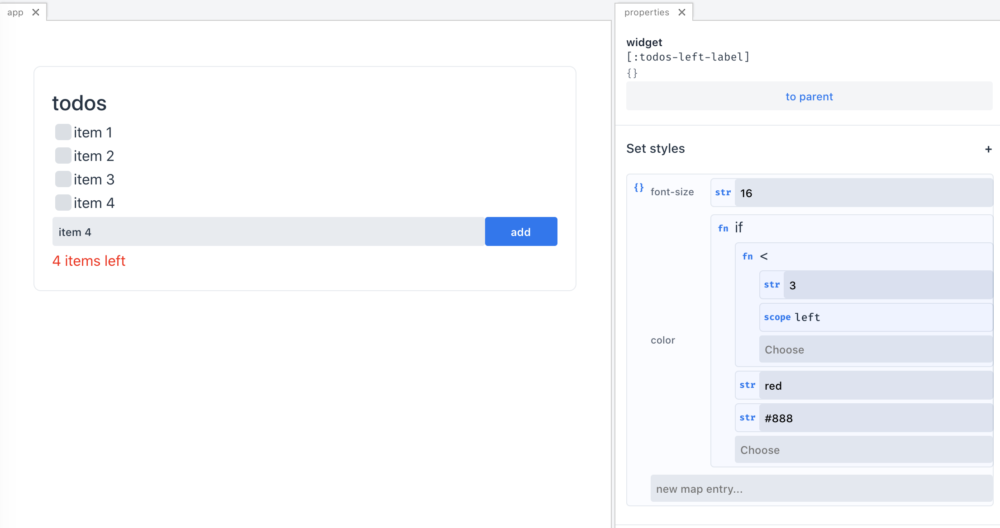

## Declarative, incremental UI

It's an experimental, not finished (and currently abandoned) project, which I decided to share, with the thought that some ideas stated below can be valuable for someone else.

The general idea was to create a graphical editor for UI of modern web apps. Such a tool could potentially speed up apps developing processes, allow non-programmers to create simple apps or interactive prototypes (in a somewhat spreadsheet-like way), or allow designers to alter the appearance of real apps without going to code.

## Building blocks

### UI as data

First of all, to make a WYSIWYG-like editor for UI it would be nice to represent our UI (composition and configuration of widgets) as data rather than as code (like e.g. in React/JSX). Data is obviously less powerful than code, but for data manipulation, easy to use, graphical tools can be created quite easily.

So, widgets can be represented as a composition of "parts". Fo example:

```
{:set-styles {:font-weight 500
              :font-size 24}
 :dom {:tag :div
       :text "todos"}}
```
Above we have a widget built from parts `:dom` (which returns a description of one DOM element) and `:set-styles` (which sets styles in the description of DOM of the current widget). Each part has parameters that can be set in the editor:


The definition of part consists of a function that does all the heavy lifting of adding new behaviors to widgets, and the metadata that can be used to display a user-friendly configuration of the part (type spec of parameters and documentation).
Parts can be thought as functions:
`(context, DOM description) => (new context, new DOM description)`. Parts as executed in a similar way to middlewares or interceptors.

Parts could not only change the DOM of a widget, but they also can modify the context/environment of the widget. This makes it possible to add some local state or fetch data and make them available to the widget.





### Incremental computations

[todo]

